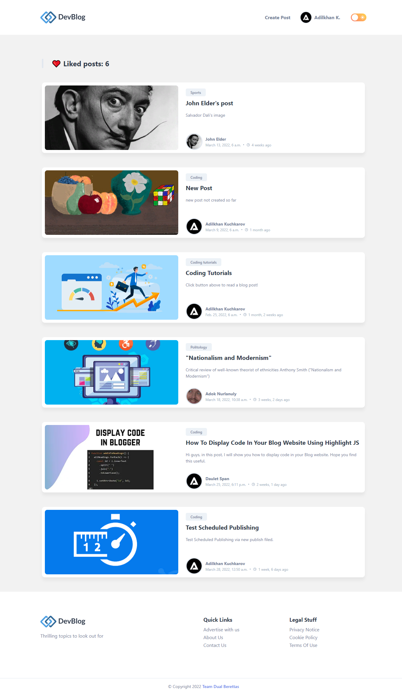
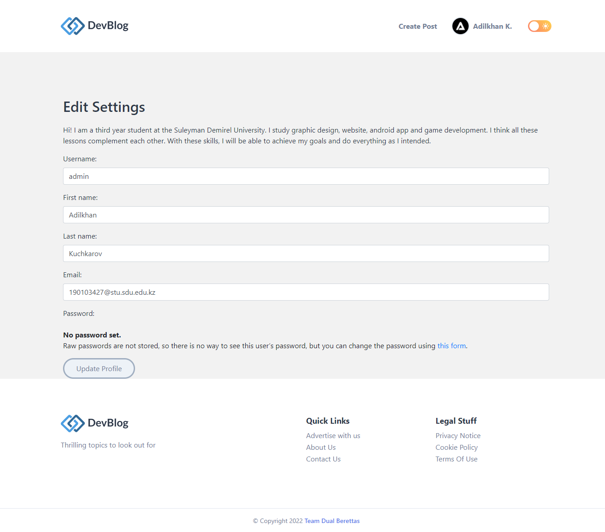

 

<h3 align="center">Team Dual Berettas</h3>
<h4 align="center"><a href="http://adilkhan.pythonanywhere.com/">Check It Out</a></h4>

Dev Blog is a blogging application. Create and share your knowledge, thoughts, ideas and experience in various spheres of life.

## Table of contents

* [General Info](#general-info)
* [Teachers](#teachers)
* [Team Members](#team-members)
* [Screenshots](#screenshots)
* [Database Schema](#database-schema)
* [Features](#features)
* [Technologies](#technologies)

## General Info

This is a blogging application written in the Django framework. It has [features](#features) of a standard blogging
platform.

## Teachers

* Sher Dadakhanov sher.dadakhanov@sdu.edu.kz
* Bissenbay Dauletbayev b.dauletbayev@sdu.edu.kz

## Team Members

* Adilkhan Kuchkarov 190103427@stu.sdu.edu.kz
* Daulet Span 190103361@stu.sdu.edu.kz

## Screenshots

|                  Home Page                  |
|:-------------------------------------------:|
|  |

|                         Post Details                         |                       Add Post                       |
|:------------------------------------------------------------:|:----------------------------------------------------:|
|  |  |

|                      Profile Page                      |
|:------------------------------------------------------:|
|  |

|                      User Posts List                       |                        Liked Posts List                        |
|:----------------------------------------------------------:|:--------------------------------------------------------------:|
|  |  |

|                        Edit Profile Page                         |                      Settings Page                       |
|:----------------------------------------------------------------:|:--------------------------------------------------------:|
|  |  |

## Database Schema

|                   Sqlite3 Database Schema                    |
|:------------------------------------------------------------:|
|  |

## Features

* WYSIWYG Editor
* Account Verification (Soon)
* Author Login
* Author Password Reset
* API for Clients (Soon)
* Category List
* Category Articles List
* New Category Submission
* Related Articles (Soon)
* Comments
* Articles Search (Soon)
* Article Social Media Share (Soon)
* Article Minute Read
* Article Number of Words (Soon)
* Article Number of Views
* Next / Previous Article
* Article Tags
* Tag Related Articles
* Most Liked Articles
* Popular Authors with the most likes
* Newsletter Subscription
* Responsive on all devices

## Technologies

* Python 3.6
* Javascript
* Jquery
* Django 4
* HTML5
* CSS3
* Bootstrap 4
* Ion Icons
* Font awesome
* CKEditor
* TinyMCE
* SQLite
